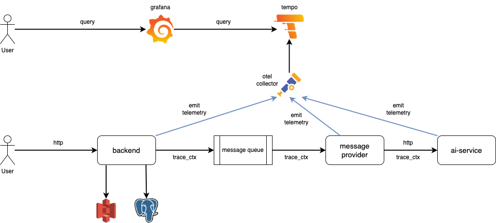

# Overview


# Bootstrap service stack
- Bootstrap stack using docker-compose
```sh
make compose
```
- Wait for the service stack started then send request to generate trace data
```sh
curl http://localhost:8000
```

# Visualize trace
- https://grafana.homelab.linhng98.com/explore
